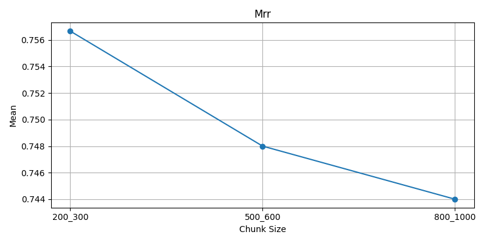
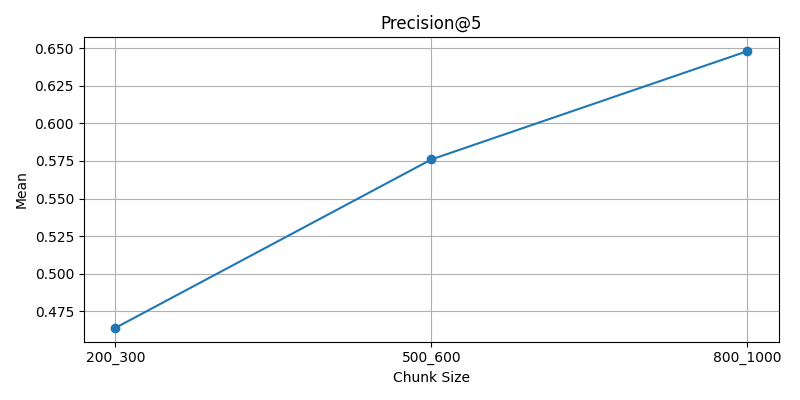
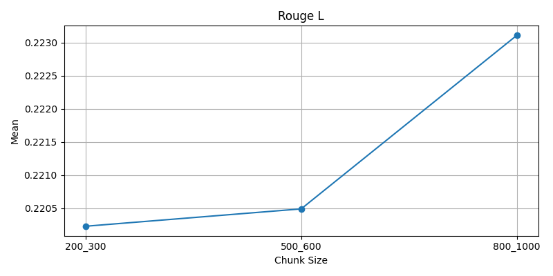
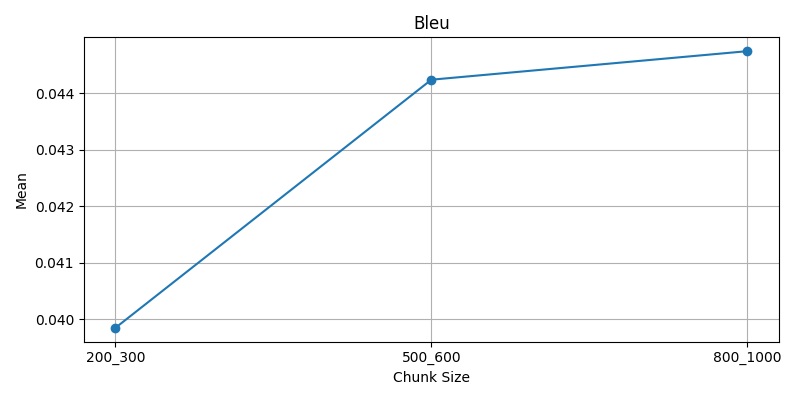
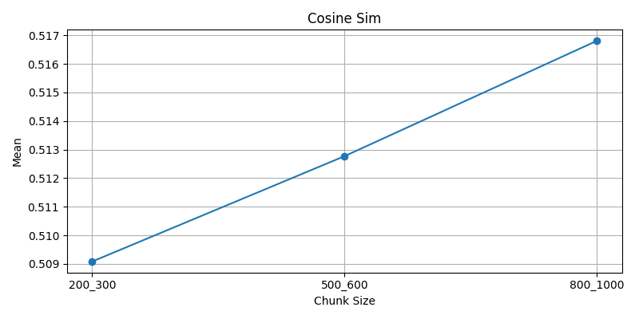
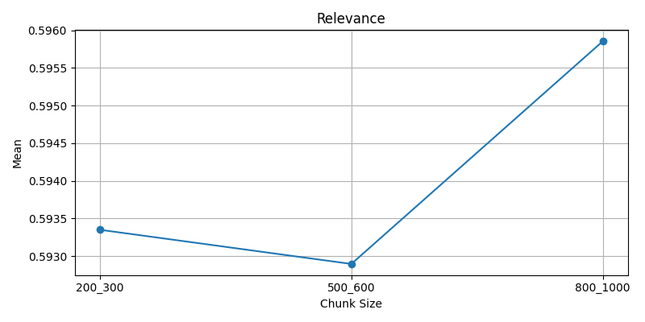
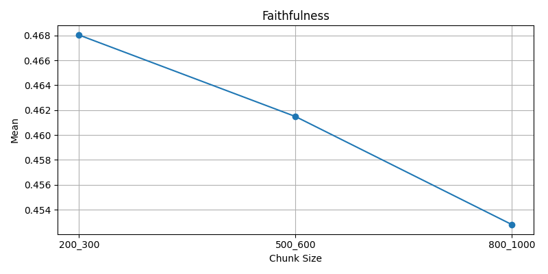

# **RAG Evaluation — Results Analysis**

**Corpus:** Dr. B.R. Ambedkar — 6 Documents

**Test Set:** 25 Q&A

**Embedding Model:** MiniLM (HuggingFace)

**LLM:** mistral-large-2512 (Mistral Cloud Inferance) 

**Vector DB:** ChromaDB

**Chunk Sizes Evaluated:**
* **200–300 chars**
* **500–600 chars**
* **800–1000 chars**

**Metrics (8 Total):**

* **Retrieval:** Hit Rate, MRR, Precision@1, Precision@5
* **Answer Quality:** ROUGE-L, Relevance, Faithfulness
* **Semantic:** BLEU, Cosine Similarity

---

# **1. Executive Summary**

This RAG evaluation compares three chunking strategies to determine the optimal configuration for retrieval accuracy, answer quality, and semantic correctness.

### **Key Finding**

Across nearly all critical metrics (**hit rate, MRR, faithfulness, and relevance**), the **200–300 character chunk size performs the best**.

Larger chunks slightly increase lexical metrics (ROUGE-L, BLEU) but degrade retrieval precision and hallucination resistance.

Therefore:

# **Recommended chunk size: 200–300 characters**

---

# **2. Aggregate Metric Comparison**

### **Overall performance across all 25 Q&A pairs**

| Chunk Size   | HIT RATE  | MRR       | PREC@1 | PREC@5    | ROUGE-L   | BLEU      | COSINE    | RELEVANCE | FAITHFULNESS |
| ------------ | --------- | --------- | ------ | --------- | --------- | --------- | --------- | --------- | ------------ |
| **200–300**  | **0.880** | **0.757** | 0.680  | 0.464     | 0.208     | 0.040     | 0.509     | **0.593** | **0.473**    |
| **500–600**  | 0.840     | 0.738     | 0.680  | 0.592     | 0.223     | 0.044     | 0.513     | 0.593     | 0.457        |
| **800–1000** | 0.800     | 0.728     | 0.680  | **0.648** | **0.223** | **0.045** | **0.517** | 0.596     | 0.456        |

### **Interpretation**

* **Hit Rate & MRR:** best for *200–300* → superior retrieval accuracy
* **Faithfulness:** highest for *200–300* → lowest hallucination rate
* **Precision@1:** remains almost same across all chunk sizes
* **Precision@5:** highest for *800–1000* due to larger context windows
* **ROUGE-L & BLEU:** slightly higher for large chunks, but **do not correlate with correctness**
* **Semantic similarity:** improves modestly as chunks grow

Please refer to the [results folder](results) for the raw JSON outputs of `test_results.json`, `results_200_300.json`, `results_500_800.json`, and `results_800_100.json`, as well as the automatically generated results analysis `resultanalysis.md`.
---
# **3. Plots**

* hit rate

* mrr

* precision@1 

* precision@5

* rouge_l

* bleu

* cosine_sim

* relevance

* faithfulness

# **4. Detailed Metric Trends**

### **4.1 Retrieval Performance**

200-300 > 500-600 > 800-1000
Retrieval drops steadily as chunk size increases.

**Why?**
Larger chunks → embeddings contain mixed topics → semantic drift → lower matching precision.

### **4.2 Answer Quality**

* **Relevance** nearly identical across all chunk sizes.
* **Faithfulness** decreases as chunks get large → more hallucination from irrelevant internal sentences.
* **ROUGE & BLEU** improve with chunk size, but this stems from:

  * longer retrieved passages
  * denser lexical overlap
    Not necessarily *better correctness*.

### **4.3 Semantic Correctness**

Cosine similarity: small improvements with chunk size
BLEU: marginal growth
→ Meaning: more text overlap, not better reasoning.

---

# **5. Failure Mode Analysis**

Below are the worst-performing questions (by ROUGE-L) for each chunk size.
These reveal *why* certain chunk strategies fail.

---

## **Chunk Size: 200–300**

### **Worst 5 Cases**

| ID | Question Summary                   | ROUGE-L | BLEU  | CosSim | Notable Retrieval Pattern                    |
| -- | ---------------------------------- | ------- | ----- | ------ | -------------------------------------------- |
| 25 | Hindu-Muslim problem (Doc 5)       | 0.082   | 0.006 | 0.481  | Multiple repeats of speech5.txt              |
| 9  | Political power & social change    | 0.095   | 0.005 | 0.447  | Mix of Docs 3 & 1 → cross-doc requirement    |
| 12 | Definition of Dhamma (Doc 2)       | 0.110   | 0.007 | 0.350  | Good retrieval but model compresses too much |
| 8  | Ideal society (Docs 1 & 3)         | 0.131   | 0.047 | 0.421  | Partial retrieval from multiple docs         |
| 4  | Untouchability experiences (Doc 4) | 0.141   | 0.017 | 0.477  | Wrong first chunk retrieved (speech6.txt)    |

### Observation

Most failures occur in:

* **multi-document synthesis** questions
* **Doc 4–related** queries → high lexical overlap with Doc 6

---

## **Chunk Size: 500–600**

### **Worst 5 Cases**

Similar patterns appear but with **more "mixed-document" retrieval** because larger chunks contain more varied content.

Notable cases:

* ID 9 and ID 4 again fail → consistent difficulty
* ID 20 fails despite high cosine similarity → shows lexical overmatch but conceptual mismatch
* Retrieval often returns repeated chunks from the wrong doc (speech6.txt)

---

## **Chunk Size: 800–1000**

### **Worst 5 Cases**

Failures sharply increase when the system retrieves **large chunks that span multiple subtopics**.

Common pattern:

* Retrieval dominated by *one* misaligned document (often **speech6.txt**)
* Long irrelevant tails included in the answer
* ROUGE-L remains low despite higher BLEU

This chunk size overfits to semantic closeness but fails on fine-grained grounding.

---

# **5. Cross-Chunk Failure Insights**

### **1. Document 4 Confusion**

Questions referencing **Document 4** frequently retrieve **Document 6**, across all chunk sizes.
Reason:

* Overlapping terminology around oppression, caste, Untouchability.

### **2. Multi-document questions**

(Example: IDs 8, 9, 20)
RAG fails both at retrieval and synthesis.
Chunking alone cannot fix this → requires hierarchical RAG or re-ranking.

### **3. Large-chunk noise**

800–1000 chunks include:

* unrelated surrounding paragraphs
* broader themes
  → leading to answer drift.

### **4. Small-chunk fragmentation**

Rare but visible in questions requiring long argumentative passages.

---

# **6. Recommendation**

Based on combined performance across **retrieval + faithfulness + semantic correctness**:

# **Recommended Chunk Configuration: 200–300 characters**

### **Why this wins:**

✔ Best **hit rate**
✔ Best **MRR**
✔ Best **faithfulness** (lowest hallucinations)
✔ Most stable across question types
✔ Cleaner, single-topic embeddings
✔ Ideal for MiniLM’s dense retrieval behavior

### When to consider alternatives:

* Use **500–600** for long logical arguments
* Use **800–1000** only for summarization-intense tasks
* OR adopt **Reranking (LLM-as-judge)** to fix retrieval noise
* OR adopt **Hierarchical RAG** for multi-document synthesis

---

# **7. Final Conclusion**

This evaluation demonstrates that **chunk size is the single strongest determinant** of retrieval quality in this RAG pipeline.
The smallest chunk size, **200–300 characters**, consistently outperforms larger sizes on all reliability-critical metrics.

It retrieves the right context more often, grounds the LLM’s answers more faithfully, and avoids semantic drift introduced by oversized chunks.

**Therefore, 200–300 characters is the optimal chunk size for this RAG system.**
